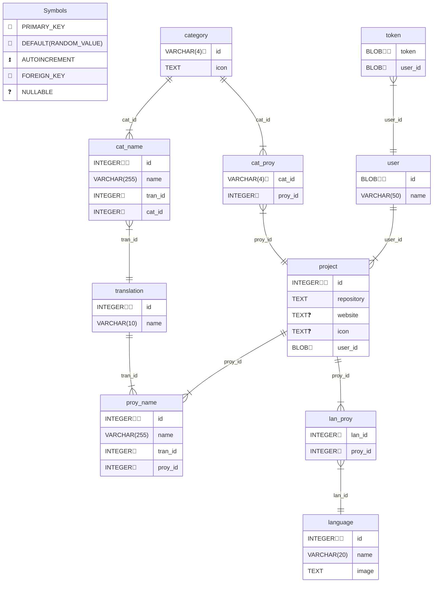

# Portfolio API

API para gestionar portfolios de desarrolladores, incluyendo proyectos, categorías y lenguajes de programación.

## Índice

- [Portfolio API](#portfolio-api)
  - [Índice](#índice)
  - [Diagrama de Rutas](#diagrama-de-rutas)
  - [Modelo de Base de Datos](#modelo-de-base-de-datos)
  - [Endpoints](#endpoints)
    - [Base URL](#base-url)
      - [Rutas Principales](#rutas-principales)
      - [Subrutas](#subrutas)
        - [`/languages`](#languages)
        - [`/categories`](#categories)
        - [`/projects/:user`](#projectsuser)

## Diagrama de Rutas

```mermaid
flowchart LR
    sym0{{USE}} & sym1([GET]) & sym2[/POST/] & sym3[\PATCH\] & sym4(DELETE) & sym5[property] & sym6[[array]] ~~~ root
    root{{/api/portfolio}} --> use0{{/languages}} & get0([/user/_:token_]) & use1{{/categories}} & get1([/translates]) & use2{{/projects/_:user_}}
    use0 --> get00([?proy&user]) & get01([/_:id_]) & post0[/ / /] & patch0[\/_:id_\] & delete0(/_:id_)
    get0 -.-> res_0[res: json] ==> res_00[id: string] & res_01[name: string]
    use1 --> get10([?proy&user]) & get11([/_:id_]) & post1[/ / /] & patch1[\/_:id_\] & delete1(/_:id_)
    get1 -.-> res_1[[res: string]]
    use2 --> get20([?lan&cat]) & get21([/_:id_]) & post2[/ / /] & patch2[\/_:id_\] & delete2(/_:id_)
    get00 -.-> res00[[res: json]] ==> res000[id: number] & res001[name: string] & res002[image: string]
    get01 -.-> res01[res: json] ==> res010[id: number] & res011[name: string] & res012[image: string]
    post0 ==> json0[body: json] ==> json00[token: string] & json01[name: string] & json02[image: string] -.-> res02[res: json] ==> res020[id: number] & res021[name: string] & res022[image: string]
    patch0 ==> json_0[body: json] ==> json_00[token: string] & json_01[name: string?] & json_02[image: string?] -.-> res03[res: json] ==> res030[id: number] & res031[name: string] & res032[image: string]
    delete0 ==> json__0[body: json] ==> json__00[token: string]
    get10 -.-> res10[[res: json]] ==> res100[id: string] & res101[icon: string] & res102[[name: json]]
    res102 ==> res1020[translation: string] & res1021[name: string]
    get11 -.-> res11[res: json] ==> res110[id: string] & res111[icon: string] & res112[[name: json]]
    res112 ==> res1120[translation: string] & res1121[name: string]
    post1 ==> json1[body: json] ==> json10[token: string] & json11[id: string] & json12[icon: string] & json13[[name: json]] -.-> res12[res: json] ==> res120[id: string] & res121[icon: string] & res122[[name: json]]
    json13 ==> json130[translation: string] & json131[name: string]
    res122 ==> res1220[translation: string] & res1221[name: string]
    patch1 ==> json_1[body: json] ==> json_10[token: string] & json_12[icon: string?] & json_13[[name: json?]] -.-> res13[res: json] ==> res130[id: string] & res131[icon: string] & res132[[name: json]]
    json_13 ==> json_130[translation: string] & json_131[name: string]
    res132 ==> res1320[translation: string] & res1321[name: string]
    delete1 ==> json__1[body: json] ==> json__10[token: string]
    get20 -.-> res20[[res: json]] ==> res200[id: number] & res201[[name: json]] & res202[repository: string] & res203[website: string?] & res204[icon: string?] & res205[[languages: json]] & res206[[categories: json]]
    res201 ==> res2010[translation: string] & res2011[name: string]
    res205 ==> res2050[id: number] & res2051[name: string] & res2052[image: string]
    res206 ==> res2060[id: string] & res2061[icon: string] & res2062[[name: json]]
    res2062 ==> res20620[translation: string] & res20621[name: string]
    get21 -.-> res21[res: json] ==> res210[id: number] & res211[[name: json]] & res212[repository: string] & res213[website: string?] & res214[icon: string?] & res215[[languages: json]] & res216[[categories: json]]
    res211 ==> res2110[translation: string] & res2111[name: string]
    res215 ==> res2150[id: number] & res2151[name: string] & res2152[image: string]
    res216 ==> res2160[id: string] & res2161[icon: string] & res2162[[name: json]]
    res2162 ==> res21620[translation: string] & res21621[name: string]
    post2 ==> json2[body: json] ==> json20[token: string] & json21[[name: json]] & json22[repository: string] & json23[website: string?] & json24[icon: string?] & json25[[languages: string]] & json26[[categories: string]] -.-> res22[res: json] ==> res220[id: number] & res221[[name: json]] & res222[repository: string] & res223[website: string?] & res224[icon: string?] & res225[[languages: json]] & res226[[categories: json]]
    json21 ==> json210[translation: string] & json211[name: string]
    res221 ==> res2210[translation: string] & res2211[name: string]
    res225 ==> res2250[id: number] & res2251[name: string] & res2252[image: string]
    res226 ==> res2260[id: string] & res2261[icon: string] & res2262[[name: json]]
    res2262 ==> res22620[translation: string] & res22621[name: string]
    patch2 ==> json_2[body: json] ==> json_20[token: string] & json_21[[name: json?]] & json_22[repository: string?] & json_23[website: string?] & json_24[icon: string?] & json_25[[languages: string?]] & json_26[[categories: string?]] -.-> res23[res: json] ==> res230[id: number] & res231[[name: json]] & res232[repository: string] & res233[website: string?] & res234[icon: string?] & res235[[languages: json]] & res236[[categories: json]]
    json_21 ==> json_210[translation: string] & json_211[name: string]
    res231 ==> res2310[translation: string] & res2311[name: string]
    res235 ==> res2350[id: number] & res2351[name: string] & res2352[image: string]
    res236 ==> res2360[id: string] & res2361[icon: string] & res2362[[name: json]]
    res2362 ==> res23620[translation: string] & res23621[name: string]
    delete2 ==> json__2[body: json] ==> json__20[token: string]
```



## Modelo de Base de Datos



## Endpoints

### Base URL

`/api/portfolio`

#### Rutas Principales

- `GET /user/:token` - Obtener información del usuario
  **Respuesta**

```json
{
  "id": "string",
  "name": "string"
}
```

- `GET /translates` - Obtener todos los idiomas disponibles
  **Respuesta**

```json
["string"]
```

#### Subrutas

##### `/languages`

- `GET ?proy&user` - Listar lenguajes (filtrable por proyecto o usuario)
  **Respuesta:**

```json
[
  {
    "id": "number",
    "name": "string",
    "image": "string"
  }
]
```

- `GET /:id` - Obtener un lenguaje específico
  **Respuesta:**

```json
{
  "id": "number",
  "name": "string",
  "image": "string"
}
```

- `POST /` - Crear nuevo lenguaje
  **Body:**

```json
{
  "token": "string",
  "name": "string",
  "image": "string"
}
```

**Respuesta:**

```json
{
  "id": "number",
  "name": "string",
  "image": "string"
}
```

- `PATCH /:id` - Actualizar lenguaje
  **Body:**

```json
{
  "token": "string",
  "name": "string?",
  "image": "string?"
}
```

**Respuesta:**

```json
{
  "id": "number",
  "name": "string",
  "image": "string"
}
```

- `DELETE /:id` - Eliminar lenguaje
  **Body:**

```json
{
  "token": "string"
}
```

##### `/categories`

- `GET ?proy&user` - Listar categorías (filtrable por proyecto o usuario)
  **Respuesta:**

```json
[
  {
    "id": "string",
    "icon": "string",
    "name": [
      {
        "translation": "string",
        "name": "string"
      }
    ]
  }
]
```

- `GET /:id` - Obtener una categoría específica
  **Respuesta:**

```json
{
  "id": "string",
  "icon": "string",
  "name": [
    {
      "translation": "string",
      "name": "string"
    }
  ]
}
```

- `POST /` - Crear nueva categoría
  **Body:**

```json
{
  "token": "string",
  "id": "string",
  "icon": "string",
  "name": [
    {
      "translation": "string",
      "name": "string"
    }
  ]
}
```

**Respuesta:**

```json
{
  "id": "string",
  "icon": "string",
  "name": [
    {
      "translation": "string",
      "name": "string"
    }
  ]
}
```

- `PATCH /:id` - Actualizar categoría
  **Body:**

```json
{
  "token": "string",
  "icon": "string?",
  "name": [
    {
      "translation": "string",
      "name": "string"
    }
  ]?
}
```

**Respuesta:**

```json
{
  "id": "string",
  "icon": "string",
  "name": [
    {
      "translation": "string",
      "name": "string"
    }
  ]
}
```

- `DELETE /:id` - Eliminar categoría
  **Body:**

```json
{
  "token": "string"
}
```

##### `/projects/:user`

- `GET ?lan&cat` - Listar proyectos (filtrable por lenguaje o categoría)
  **Respuesta:**

```json
[
  {
    "id": "number",
    "name": [
      {
        "translation": "string",
        "name": "string"
      }
    ],
    "repository": "string",
    "website": "string?",
    "icon": "string?",
    "languages": [
      {
        "id": "number",
        "name": "string",
        "image": "string"
      }
    ],
    "categories": [
      {
        "id": "string",
        "icon": "string",
        "name": [
          {
            "translation": "string",
            "name": "string"
          }
        ]
      }
    ]
  }
]
```

- `GET /:id`- Obtener un proyecto específico
  **Respuesta:**

```json
{
  "id": "number",
  "name": [
    {
      "translation": "string",
      "name": "string"
    }
  ],
  "repository": "string",
  "website": "string?",
  "icon": "string?",
  "languages": [
    {
      "id": "number",
      "name": "string",
      "image": "string"
    }
  ],
  "categories": [
    {
      "id": "string",
      "icon": "string",
      "name": [
        {
          "translation": "string",
          "name": "string"
        }
      ]
    }
  ]
}
```

- `POST /` - Crear nuevo proyecto
  **Body:**

```json
{
  "token": "string",
  "name": [
    {
      "translation": "string",
      "name": "string"
    }
  ],
  "repository": "string",
  "website": "string?",
  "icon": "string?",
  "languages": ["string"],
  "categories": ["string"]
}
```

**Respuesta:**

```json
{
  "id": "number",
  "name": [
    {
      "translation": "string",
      "name": "string"
    }
  ],
  "repository": "string",
  "website": "string?",
  "icon": "string?",
  "languages": [
    {
      "id": "number",
      "name": "string",
      "image": "string"
    }
  ],
  "categories": [
    {
      "id": "string",
      "icon": "string",
      "name": [
        {
          "translation": "string",
          "name": "string"
        }
      ]
    }
  ]
}
```

- `PATCH /:id` - Actualizar proyecto
  **Body:**

```json
{
  "token": "string",
  "name": [
    {
      "translation": "string",
      "name": "string"
    }
  ]?,
  "repository": "string?",
  "website": "string?",
  "icon": "string?",
  "languages": ["string"]?,
  "categories": ["string"]?
}
```

**Respuesta:**

```json
{
  "id": "number",
  "name": [
    {
      "translation": "string",
      "name": "string"
    }
  ],
  "repository": "string",
  "website": "string?",
  "icon": "string?",
  "languages": [
    {
      "id": "number",
      "name": "string",
      "image": "string"
    }
  ],
  "categories": [
    {
      "id": "string",
      "icon": "string",
      "name": [
        {
          "translation": "string",
          "name": "string"
        }
      ]
    }
  ]
}
```

- `DELETE /:id` - Eliminar proyecto
  **Body:**

```json
{
  "token": "string"
}
```
