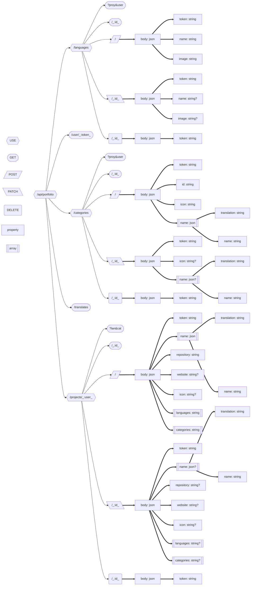
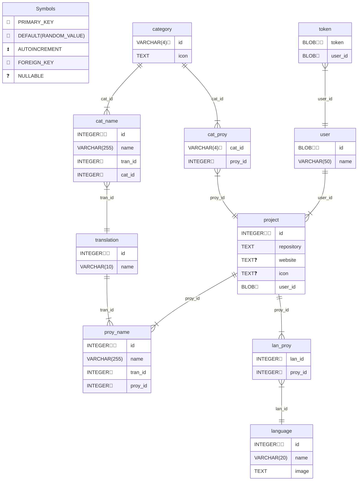

# Portfolio API

API para gestionar portfolios de desarrolladores, incluyendo proyectos, categorías y lenguajes de programación.

## Índice

- [Diagrama de Rutas](#diagrama-de-rutas)
- [Modelo de Base de Datos](#modelo-de-base-de-datos)
- [Endpoints](#endpoints)
  - [Base URL](#base-url)
  - [Rutas Principales](#rutas-principales)
  - [Subrutas](#subrutas)
  - [`/languages`](#languages)
  - [`/categories`](#categories)
  - [`/projects/:user`](#projectsuser)

## Diagrama de Rutas



## Modelo de Base de Datos



## Endpoints

### Base URL

`/api/portfolio`

### Rutas Principales

1. **User**
   - `GET /user/:token` - Obtener información del usuario
2. **Translates**
   - `GET /translates` - Obtener todas las traducciones disponibles

### Subrutas

#### `/languages`

- `GET ?proy&user` - Listar lenguajes (filtrable por proyecto o usuario)
- `GET /:id` - Obtener un lenguaje específico
- `POST /` - Crear nuevo lenguaje

```json
{
  "token": "string",
  "name": "string",
  "image": "string"
}
```

- `PATCH /:id` - Actualizar lenguaje

```json
{
  "token": "string",
  "name": "string?",
  "image": "string?"
}
```

- `DELETE /:id` - Eliminar lenguaje

```json
{
  "token": "string"
}
```

#### `/categories`

- `GET ?proy&user` - Listar categorías (filtrable por proyecto o usuario)
- `GET /:id` - Obtener una categoría específica
- `POST /` - Crear nueva categoría

```json
{
  "token": "string",
  "id": "string",
  "icon": "string",
  "name": [
    {
      "translation": "string",
      "name": "string"
    }
  ]
}
```

- `PATCH /:id` - Actualizar categoría

```json
{
  "token": "string",
  "icon": "string?",
  "name": [
    {
      "translation": "string",
      "name": "string"
    }
  ]?
}
```

- `DELETE /:id` - Eliminar categoría

```json
{
  "token": "string"
}
```

#### `/projects/:user`

- `GET ?lan&cat` - Listar proyectos (filtrable por lenguaje o categoría)
- `GET /:id`- Obtener un proyecto específico
- `POST /` - Crear nuevo proyecto

```json
{
  "token": "string",
  "name": [
    {
      "translation": "string",
      "name": "string"
    }
  ],
  "repository": "string",
  "website": "string?",
  "icon": "string?",
  "languages": ["string"],
  "categories": ["string"]
}
```

- `PATCH /:id` - Actualizar proyecto

```json
{
  "token": "string",
  "name": [
    {
      "translation": "string",
      "name": "string"
    }
  ]?,
  "repository": "string?",
  "website": "string?",
  "icon": "string?",
  "languages": ["string"]?,
  "categories": ["string"]?
}
```

- `DELETE /:id` - Eliminar proyecto

```json
{
  "token": "string"
}
```
